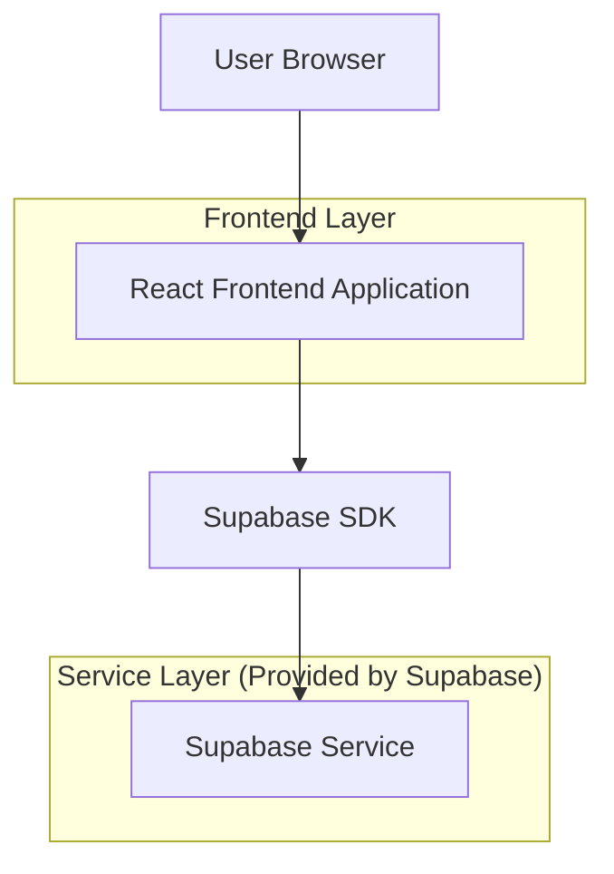
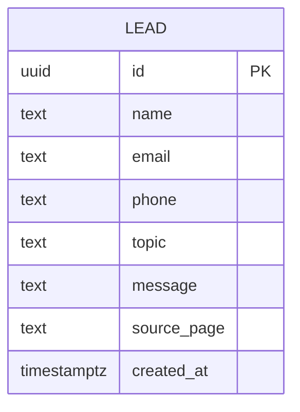

## 1.Architecture design


## 2.Technology Description
- Frontend: React@18 + tailwindcss@3 + vite
- Backend: None
- BaaS (minimalne, pod formularz kontaktowy): Supabase (PostgreSQL) + Storage (opcjonalnie, np. na pliki/brief)

## 3.Route definitions
| Route | Purpose |
|-------|---------|
| / | Strona główna: pozycjonowanie, skrót usług, zaufanie, CTA |
| /uslugi | Usługi: szczegóły oferty, pakiety, FAQ, CTA |
| /kontakt | Kontakt: formularz + dane kontaktowe + potwierdzenie |
| /* | 404: powrót do strony głównej |

## 6.Data model(if applicable)
### 6.1 Data model definition


### 6.2 Data Definition Language
Leady (leads)
```
CREATE TABLE leads (
  id UUID PRIMARY KEY DEFAULT gen_random_uuid(),
  name TEXT NOT NULL,
  email TEXT NOT NULL,
  phone TEXT,
  topic TEXT,
  message TEXT NOT NULL,
  source_page TEXT,
  created_at TIMESTAMP WITH TIME ZONE DEFAULT NOW()
);

ALTER TABLE leads ENABLE ROW LEVEL SECURITY;

-- polityki: anon może tylko dodawać; odczyt tylko dla zalogowanych (panel operacyjny poza zakresem strony)
CREATE POLICY "anon_insert_leads" ON leads
  FOR INSERT TO anon
  WITH CHECK (true);

CREATE POLICY "auth_read_leads" ON leads
  FOR SELECT TO authenticated
  USING (true);

GRANT INSERT ON leads TO anon;
GRANT ALL PRIVILEGES ON leads TO authenticated;
```
