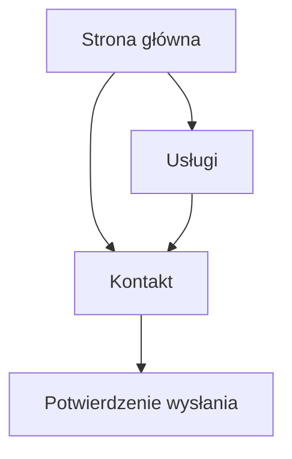

## 1. Product Overview
Nowoczesna, premium strona WWW dla marki W. Safe Finance (fintech/banking) nastawiona na budowanie zaufania i generowanie leadów.
Twoim celem jako użytkownika jest szybkie zrozumienie oferty, wiarygodności firmy i łatwy kontakt.

## 2. Core Features

### 2.1 Feature Module
Wymagania obejmują następujące kluczowe strony:
1. **Strona główna**: hero z obietnicą wartości, skróty usług, dowody zaufania, CTA do kontaktu.
2. **Usługi**: szczegóły oferty (zakres, dla kogo, proces), pakiety/warianty, CTA.
3. **Kontakt**: formularz, dane kontaktowe, lokalizacja (opcjonalnie), potwierdzenie wysłania.

### 2.2 Page Details
| Page Name | Module Name | Feature description |
|-----------|-------------|---------------------|
| Strona główna | Nawigacja + CTA | Prowadzić do „Usługi” i „Kontakt”; wyróżnić główne CTA (np. „Umów konsultację”). |
| Strona główna | Hero (propozycja wartości) | Komunikować premium/bezpieczeństwo: nagłówek, podtytuł, 1–2 CTA. |
| Strona główna | Skrót usług | Przedstawić 3–6 kluczowych obszarów oferty jako karty z krótkim opisem i linkiem. |
| Strona główna | Zaufanie | Budować wiarygodność: liczby (np. „X lat”), standardy pracy, kluczowe przewagi. |
| Strona główna | Jak pracujemy | Wyjaśnić proces w 3–5 krokach (od diagnozy do wdrożenia). |
| Strona główna | Sekcja „Dlaczego W. Safe Finance” | Porównać podejście (minimalnie: 3 punkty) i utrwalić pozycjonowanie premium. |
| Strona główna | Stopka | Udostępnić dane firmy, skróty nawigacji, social (jeśli są). |
| Usługi | Lista usług + szczegóły | Zaprezentować każdą usługę: problem → rozwiązanie → rezultat → dla kogo. |
| Usługi | Pakiety / warianty | Umożliwić porównanie 2–3 wariantów (zakres, czas, oczekiwany efekt) i CTA. |
| Usługi | FAQ | Odpowiedzieć na najczęstsze pytania (6–10), redukując bariery kontaktu. |
| Kontakt | Formularz kontaktowy | Zebrać minimum danych: imię/nazwa, e-mail, telefon (opc.), temat, wiadomość; walidacja; zgoda na kontakt (jeśli wymagana). |
| Kontakt | Dane kontaktowe | Wyświetlić e-mail/telefon, godziny kontaktu, adres (jeśli używany). |
| Kontakt | Stan po wysłaniu | Pokazać potwierdzenie + informację o czasie odpowiedzi. |

## 3. Core Process
**Flow użytkownika (od wejścia do leada):**
1) Wchodzisz na stronę główną → 2) przeglądasz skrót usług i przewagi → 3) przechodzisz do „Usługi”, aby potwierdzić dopasowanie → 4) klikasz CTA → 5) wysyłasz formularz w „Kontakt” i widzisz potwierdzenie.

